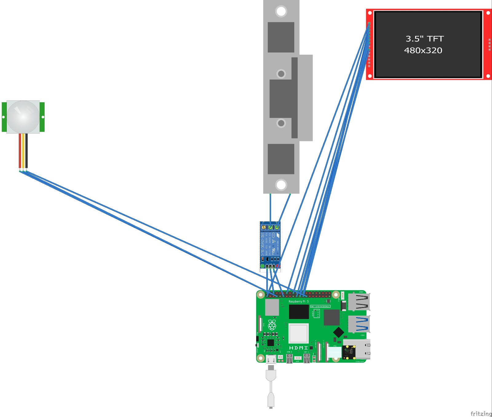

# RPI5-AI-Door-Lock

A secure, AI-powered door lock system built with Raspberry Pi 5, face recognition, and object classification using YOLOv8. The system grants access based on facial recognition and integrates with a delivery classification model for identifying and training on delivery personnel.

---

## Project Structure 📂

This project consists of the following folders:

- **images**: Contains all the images used in the README, including the Fritzing architecture, project structure diagrams, and real-world photos.
- **face_rec**: Contains the Raspberry Pi 5 logic, datasets for face training, scripts for face detection, and door control via GPIO pins.
  - This folder also has a script to detect faces and movement from the PIR motion sensor, opening the door with an electric strike device when authorized.
  - **Important**: If the face detected is unknown, the system will notify the user, asking whether it’s a delivery, resident, or guest.
- **delivery_classification**: Contains the object classification model to identify delivery personnel.
  - The system takes frames (20 seconds before and after the detected unknown face) and uses them to train the YOLOv8 model on the delivery personnel.
  - We are using Roboflow for object classification training.

---

## Overview 🔍

The **RPI5-AI-Door-Lock** is an advanced security system integrating multiple technologies:

1. **Face Recognition**: Detects and identifies faces in real-time.
2. **PIR Motion Sensor**: Detects movement to trigger the camera and lock mechanism.
3. **Real-Time Object Classification**: Identifies whether an unknown face is a delivery person using a custom YOLOv8 model trained with Roboflow.
4. **Door Control**: Using an electric strike device to lock and unlock the door.

---

## Getting Started 🚀

Follow the steps below to set up and run the project:

### 1. Prerequisites
- Raspberry Pi 5
- PIR motion sensor
- Electric strike door lock (e.g., [UHPPOTE Electric Strike](https://www.amazon.com/UHPPOTE-Electric-Strike-Fail-Secure-Control/dp/B00V45GWTI?th=1))
- OpenCV, TensorFlow Lite, PyTorch, FastAPI, and React installed

### 2. Installation
Clone the repository:

```bash
git clone https://github.com/itaim18/RPI5-AI-Door-Lock.git
cd RPI5-AI-Door-Lock
```

### 3. Setup the `face_rec` folder
- **Dataset**: Place images of authorized faces into the `face_rec/datasets` folder.
- **Training**: Use the provided script to train the face recognition model. The model uses OpenCV for face detection and classification.
- **Motion Detection**: The system monitors motion with the PIR sensor and activates the camera when movement is detected.
- **Door Control**: When a face is detected and recognized, the script will control the door lock with the GPIO pins connected to the electric strike.

### 4. Setup the `delivery_classification` folder
- **YOLOv8 Model**: Place the frames captured from the camera (before and after face detection) in this folder to train the delivery classification model.
- **Roboflow Integration**: Use Roboflow to create and manage your custom YOLOv8 model and upload your dataset for object detection training. 
- **Classification Flow**: When an unknown face is detected, the system sends this face to the server, which then asks the user if it’s a delivery person. If marked as delivery, the frames are sent back to train the YOLOv8 model.

---

## Scripts Overview 📜

### 1. **face_rec/main.py**
- This is the main script for detecting faces and triggering the door lock system.
- It interacts with the PIR motion sensor and controls the GPIO pins for door lock/unlock.
- If an unknown face is detected, the system queries the user to classify the person as a resident, guest, or delivery.

### 2. **face_rec/train.py**
- Script used for collecting face data (images) and training the face recognition model.

### 3. **face_rec/inference.py**
- Runs the face detection and recognition logic.
- If an unknown face is detected, it will communicate with the server for user input.

### 4. **delivery_classification/train_yolo.py**
- This script captures the frames for training the YOLOv8 model on delivery personnel. The frames are captured around an unknown face detection event and sent to the classification server.
- The trained YOLOv8 model will then classify the detected face as a delivery person or not.

---

## Fritzing Diagram 🔌

The **images** folder contains the Fritzing diagrams used to wire the Raspberry Pi, PIR sensor, and electric strike device. Below is an example of how the wiring should look:



## The real life challenge

It also containe images such as below, that show the real life implication of our project


---

## How It Works 🔒

1. **Face Detection**: The Raspberry Pi 5, with an attached AI camera, continuously captures frames.
2. **Motion Detection**: If motion is detected by the PIR sensor, the camera starts capturing video and tries to detect faces.
3. **Face Recognition**: The system matches the face with a known dataset. If the face is recognized, the door is unlocked.
4. **Unknown Faces**: If the system detects an unknown face, it sends a notification to the user, asking whether the person is a delivery, guest, or resident.
5. **Delivery Classification**: If the person is marked as a delivery, frames around the event are taken and used to train a YOLOv8 model to recognize delivery personnel in future events.

---

## Troubleshooting ⚙️

- **Face Detection Issues**: Ensure that the camera is focused and positioned correctly. Adjust the threshold in the `face_rec` scripts if necessary.
- **Motion Sensor**: Ensure the PIR sensor is correctly connected to the Raspberry Pi. Double-check GPIO pins for correct wiring.
- **Server Communication**: Make sure the FastAPI server is running and accessible for classification when an unknown face is detected.

---

## References & Further Reading 📚

- **[Raspberry Pi 5 Documentation](https://www.raspberrypi.com/documentation/)**
- **[OpenCV Face Detection](https://docs.opencv.org/)**
- **[YOLOv8 Documentation](https://roboflow.com/)**
- **[Roboflow](https://roboflow.com/)**

"# RPI5-AI-Doorlock" 
