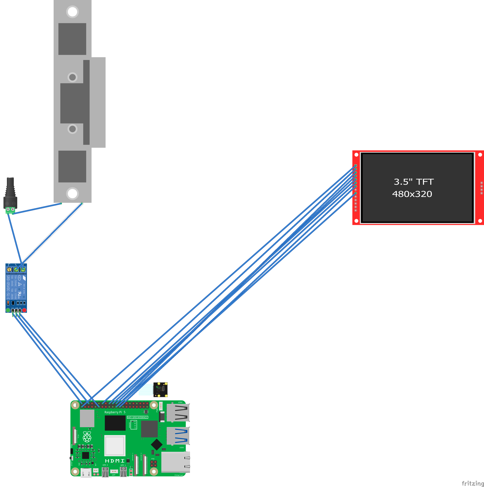
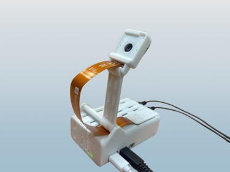

# RPI5-AI-Doorlock

A secure, AI-powered door lock system built around **Raspberry Pi 5**, advanced **face recognition**, and **object classification** with **YOLOv8**. The system grants access based on facial recognition and integrates a delivery classification model for identifying and training on delivery personnel. It leverages a **Node.js** server, a **React** front-end, and **MongoDB** for data storage.


https://github.com/user-attachments/assets/7e7a05ca-6547-470a-9da9-36588a0159b5


---

## Project Structure 📂

This project contains the following folders:

- **images**  
  Holds all the images used in the README, including Fritzing diagrams, project structure illustrations, and real-world photos.

- **face_rec**  
  Contains the Raspberry Pi 5 logic, datasets for face training, and scripts for face detection and door control via a relay module.  
  - The scripts detect faces using the Pi AI camera, compare them against known faces, and control an electric strike device via a **5V relay**.  
  - **Important**: If an unknown face is detected, the system will notify the user (via the Node.js server and React front-end) to classify whether it’s a delivery, resident, or guest.

- **delivery_classification**  
  Contains the object classification model for identifying delivery personnel.  
  - The system takes frames (20 seconds before and after an unknown face event) and uses them to train the **YOLOv8** model.  
  - Uses **Roboflow** to manage and train the custom YOLOv8 model.  
  - **Emphasis**: We utilize the Pi’s built-in accelerator and can export YOLOv8 models as IMX500-compatible network models that run directly on the camera itself for efficient edge inference.

---

## Overview 🔍

The **RPI5-AI-Door-Lock** is an advanced security system that integrates:

1. **Face Recognition**  
   Real-time face detection and recognition using OpenCV (for detection) and a trained classification model.

2. **Delivery Classification**  
   A YOLOv8-based model (trained via Roboflow) identifies if the unknown face is likely a delivery person. Over time, new data (frames) is collected and used to retrain/improve the model.

3. **Door Control**  
   An electric strike device (powered by a 12V AC-DC adapter) is locked/unlocked via a **5V relay** connected to the Raspberry Pi’s GPIO pins.

4. **Server & Front-End**  
   A **Node.js** server handles incoming data from the Pi, stores it in **MongoDB**, and serves a **React** web application that allows users to monitor activity, classify unknown faces, and manage access control.

---

## Getting Started 🚀

### 1. Prerequisites
- **Hardware**  
  - Raspberry Pi 5  
  - Pi AI Camera (capable of running YOLOv8/IMX500 models)  
  - 5V Relay Module  
  - Electric strike door lock (12V)  
  - 12V AC-DC power adapter  
- **Software**  
  - Node.js  
  - MongoDB  
  - React  
  - OpenCV, TensorFlow Lite (or PyTorch), YOLOv8 (via Roboflow exports)

### 2. Installation

#### Pre-Project Preparation Video
Before starting the setup, watch this video for an overview of the hardware assembly and software configuration:
[Watch the Setup Overview Video](https://youtu.be/bAyKtSKfJQg?si=mtt_KBPnvokF1VEy)

#### Clone the repository:
```bash
git clone https://github.com/itaim18/RPI5-AI-Door-Lock.git
cd RPI5-AI-Door-Lock
```


### 3. Wiring the Door Lock (Relay + Electric Strike)
1. **Electric Strike**:  
   - Connect the electric strike to the **12V AC-DC adapter**.  
   - The relay will act as the switch to provide or cut power to the strike.

2. **5V Relay Module**:  
   - **VCC** pin → **5V** on Raspberry Pi 5  
   - **GND** pin → **GND** on Raspberry Pi 5  
   - **IN** pin → **GPIO** pin on Raspberry Pi 5 (e.g., GPIO17)  
   - **COM** and **NO/NC** on the relay connect to the electric strike circuit (depending on whether you need normally open or normally closed configuration).

3. **Control Logic**:  
   - The Raspberry Pi 5 sets the GPIO pin **HIGH** or **LOW** to energize the relay coil, thus unlocking the door by powering the electric strike.

*(Refer to the [Fritzing Diagram](images/RPI-doorlock_bb.png) in the `images` folder for more details.)*

---

## Setup the `face_rec` Folder

1. **Datasets**:  
   Place images of authorized faces into the `face_rec/datasets` folder. Organize them by person name or ID.

2. **Training**:  
   Use the provided script to train the face recognition model. By default, it uses OpenCV for face detection and classification.

3. **Door Control**:  
   When a recognized face is detected, the script will activate the GPIO pin controlling the **5V relay**, thereby unlocking the door.

4. **Unknown Faces**:  
   If the system detects an unknown face, it notifies the user via the Node.js server. The React front-end prompts the user to classify the person as **resident**, **guest**, or **delivery**.

---

## Setup the `delivery_classification` Folder

1. **YOLOv8 Model & Roboflow**:  
   - Configure your Roboflow project to manage the YOLOv8 model.  
   - Export the model in a format suitable for the Pi AI camera’s accelerator (e.g., IMX500-compatible if supported).  

2. **Data Collection**:  
   - The system captures frames ~20 seconds before and after an unknown face event.  
   - These frames are stored in the `delivery_classification` folder (or uploaded directly to Roboflow) for further training.

3. **Training & Inference**:  
   - Run the `train_yolo.py` (or equivalent script) to push new frames to Roboflow.  
   - Retrain the YOLOv8 model and export it back to the Pi for local inference.  
   - The updated model helps identify delivery personnel more accurately over time.

---

## Scripts Overview 📜

1. **face_rec/main.py**  
   - Detects faces using the Pi AI camera.  
   - Compares against known datasets to authenticate.  
   - Controls the relay to lock/unlock the door.

2. **face_rec/train.py**  
   - Collects face images and trains the face recognition model using OpenCV.

3. **face_rec/inference.py**  
   - Performs face detection/recognition in real-time.  
   - On unknown faces, communicates with the Node.js server to get user classification (resident, guest, or delivery).

4. **delivery_classification/train_yolo.py**  
   - Captures frames around unknown face events.  
   - Sends data to Roboflow for YOLOv8 training.  
   - Retrieves and updates the local model for improved delivery recognition.

---

## Fritzing Diagram 🔌

The `images` folder contains the Fritzing diagrams showing how to wire the **Raspberry Pi 5**, **5V relay**, and **electric strike**. Below is an example:



---

## The Real-Life Challenge

We’ve also included real-world images (e.g., `PICaso.png`) showcasing how this project applies in practical scenarios:



---

## How It Works 🔒

1. **Face Detection**  
   The Pi AI camera continuously captures frames. The system uses OpenCV to detect and crop faces in real-time.

2. **Face Recognition**  
   If the face is recognized (matched against known datasets), the Pi signals the relay to unlock the door.

3. **Unknown Faces**  
   If the face is unknown, a notification is sent to the Node.js server, which updates the React web app. The user can then classify the unknown person as **delivery**, **guest**, or **resident**.

4. **Delivery Classification**  
   If marked as **delivery**, the frames are automatically sent to the `delivery_classification` workflow. Roboflow trains or retrains a YOLOv8 model with these new images. The updated model can be exported back to the Pi in an IMX500-compatible format (if supported) to run on the camera’s accelerator.

5. **Door Control**  
   Once authorized, the Raspberry Pi energizes the 5V relay, unlocking the electric strike with 12V power.

---

## Troubleshooting ⚙️

- **Face Recognition**  
  - Ensure the camera is properly focused and the lighting is adequate.  
  - Adjust detection thresholds in `face_rec/main.py` or `inference.py` if the system is too strict/lenient.

- **Relay & Electric Strike**  
  - Verify the relay wiring: VCC to 5V, GND to Pi GND, IN to a valid GPIO pin.  
  - Confirm the electric strike is rated for 12V and you have a compatible power adapter.

- **Node.js Server**  
  - Make sure the server is running and can connect to MongoDB.  
  - Check your `.env` or config files for the correct MongoDB connection string.

- **YOLOv8 Model Updates**  
  - If the model isn’t updating, confirm you have the correct Roboflow API keys/config.  
  - Ensure you’re exporting the model in a format the Pi camera’s accelerator supports.

---

## References & Further Reading 📚

- [itaimiz.com Blog on RPI5 Door Lock Project](https://itaimiz.com/blog/rpi5-doorlock)  
- [Final Website](https://ai-lock.itaimiz.com)
- [DIY Engineers - Face recognition full guide](https://core-electronics.com.au/guides/raspberry-pi/face-recognition-with-raspberry-pi-and-opencv/)
- [Raspberry Pi 5 Documentation](https://www.raspberrypi.com/documentation/)  
- [OpenCV Official Docs](https://docs.opencv.org/)  
- [YOLOv8 / Roboflow Documentation](https://roboflow.com/)  
- [Node.js Official Docs](https://nodejs.org/en/docs/)  
- [MongoDB Official Docs](https://www.mongodb.com/docs/)  


*(Please let me know if you have additional sources to include.)*

